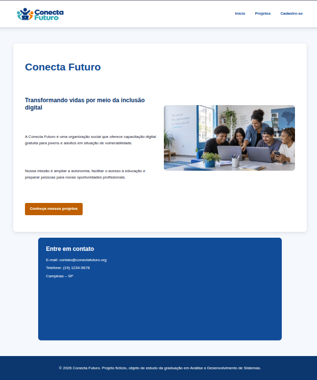

# Conecta Futuro



O **Conecta Futuro** é um projeto acadêmico de desenvolvimento front-end que apresenta uma plataforma digital para divulgação de ações sociais, projetos de inclusão digital, oportunidades de voluntariado e campanhas de doação.

> **Aviso:** a Conecta Futuro é uma ONG fictícia, criada exclusivamente para este projeto de faculdade. As iniciativas, informações e resultados apresentados no site são demonstrativos e não representam uma organização real.

## Objetivo do projeto

O projeto foi desenvolvido para aplicar, de maneira prática, conceitos de HTML, CSS e JavaScript. A aplicação simula a presença digital de uma organização do terceiro setor e busca oferecer uma navegação clara, acessível e adaptável a diferentes tamanhos de tela.

## Funcionalidades

* Página inicial com apresentação da ONG fictícia;
* divulgação de projetos de inclusão digital;
* informações sobre voluntariado e doações;
* formulário de cadastro com validação em tempo real;
* mensagens visuais de erro e sucesso;
* persistência de dados não sensíveis no `localStorage`;
* navegação no formato Single Page Application (SPA);
* criação dinâmica de componentes com Template Literals;
* menu responsivo com submenu;

## Tecnologias utilizadas

* HTML5;
* CSS3;
* JavaScript ES6+;
* CSS Grid e Flexbox;
* DOM e eventos;
* Fetch API;
* Web Storage API (`localStorage`);
* ES6 Modules (`import` e `export`).

## Estrutura de pastas

```text
conecta-futuro/
├── css/
│   ├── cadastro.css
│   ├── global.css
│   ├── index.css
│   ├── projetos.css
│   └── variables.css
├── html/
│   ├── cadastro.html
│   ├── index.html
│   └── projetos.html
├── img/
│   ├── favicon.svg
│   ├── inclusao-digital.png
│   └── logo-conecta-futuro.png
├── js/
│   ├── main.js
│   ├── navigation.js
│   ├── storage.js
│   ├── templates.js
│   └── validation.js
└── README.md
```

## Responsabilidade dos módulos JavaScript

* `main.js`: inicializa os módulos principais da aplicação;
* `navigation.js`: controla as rotas, o carregamento das páginas e a troca dos estilos;
* `templates.js`: gera os componentes da página de projetos;
* `validation.js`: valida o formulário e apresenta mensagens de feedback;
* `storage.js`: grava e recupera dados não sensíveis no `localStorage`.

## Como executar localmente

### Pré-requisitos

* navegador atualizado;
* Visual Studio Code ou outro editor de código;
* extensão Live Server, caso utilize o Visual Studio Code.

### Execução

1. Clone o repositório:

```bash
git clone https://github.com/yazancan/conecta-futuro.git
```

2. Acesse a pasta do projeto:

```bash
cd conecta-futuro
```

3. Abra a pasta no Visual Studio Code.
4. Localize o arquivo `html/index.html`.
5. Clique com o botão direito sobre ele.
6. Selecione **Open with Live Server**.

O uso de um servidor local é recomendado porque a navegação da aplicação utiliza a Fetch API para carregar os conteúdos HTML.

## Armazenamento local

Os cadastros são armazenados no navegador com `localStorage`. Apenas informações básicas são persistidas para fins demonstrativos. Dados sensíveis, como CPF, telefone e endereço, não são armazenados.

